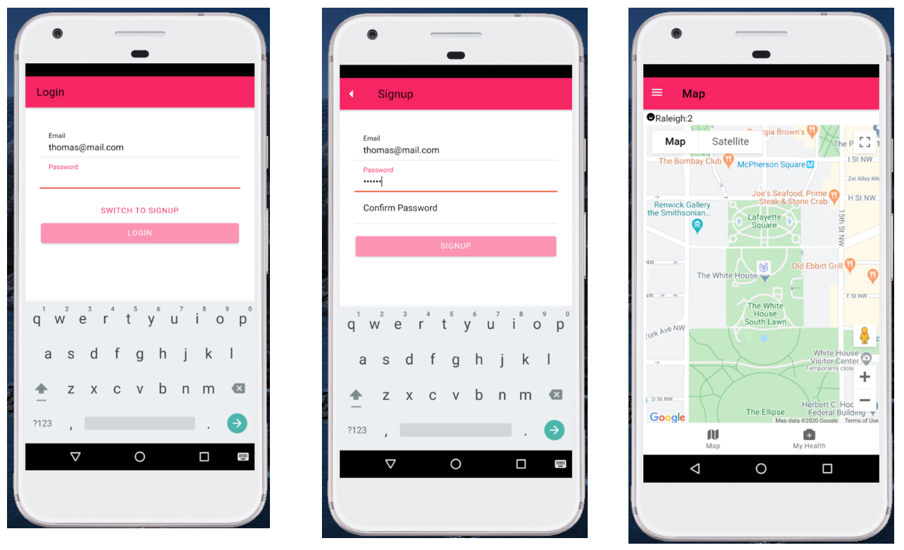
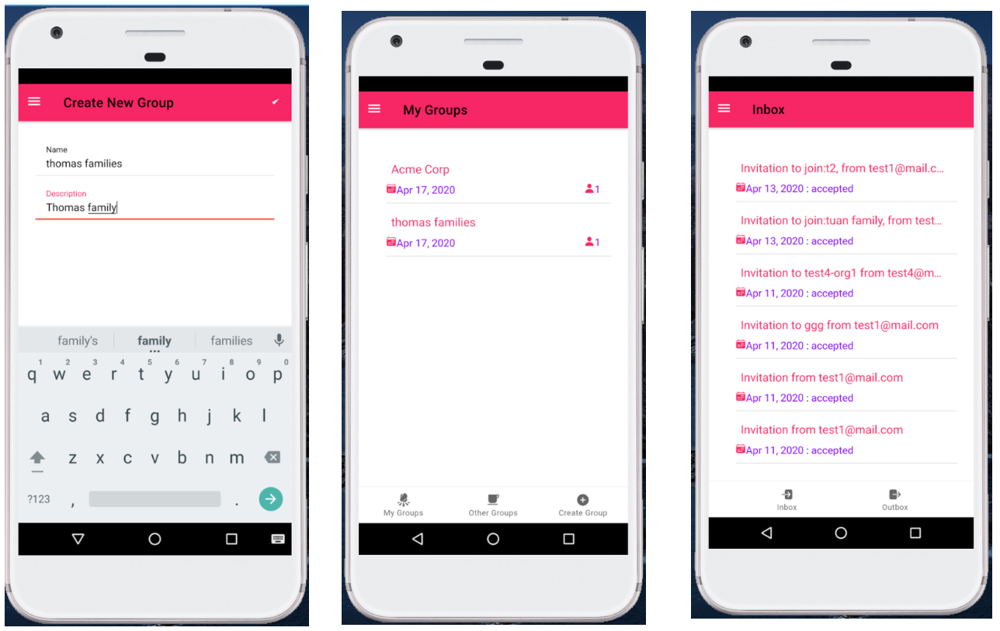
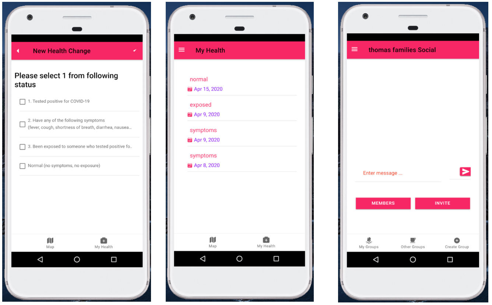
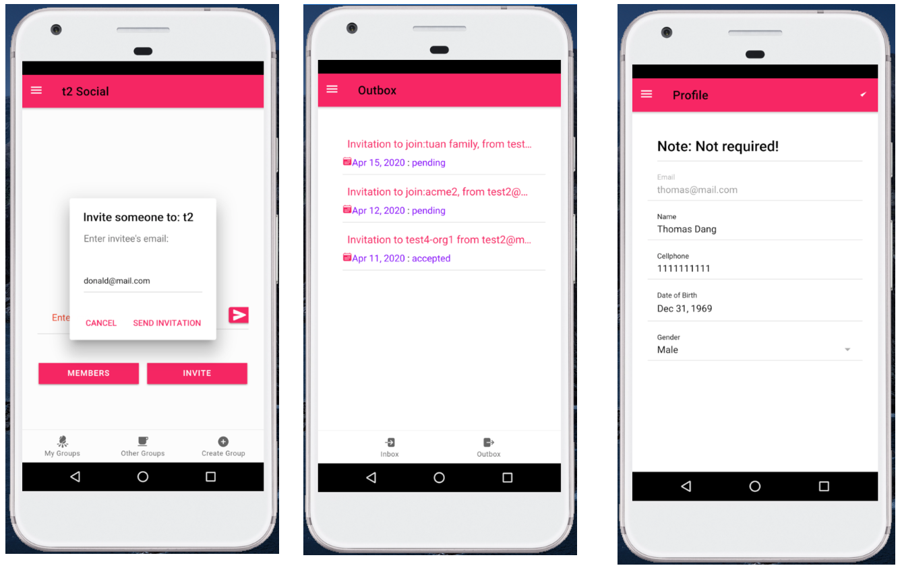
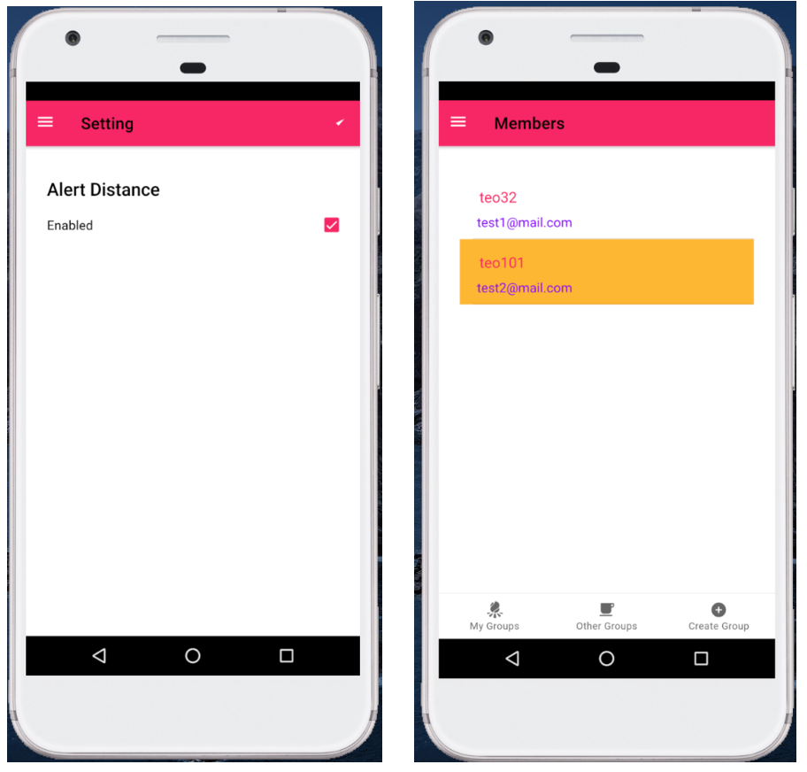

# WeCare

  

## Contents

1. [Short description](#short-description)
1. [Demo video](#demo-video)
1. [The architecture](#the-architecture)
1. [Long description](#long-description)
1. [Project roadmap](#project-roadmap)
1. [Getting started](#getting-started)
1. [Running the tests](#running-the-tests)
1. [Live demo](#live-demo)
1. [Built with](#built-with)
1. [Contributing](#contributing)
1. [Versioning](#versioning)
1. [Authors](#authors)
1. [License](#license)
1. [Acknowledgments](#acknowledgments)

## Short description

### What's the problem?

You, me and others are single individuals in the world. The world is conquered and attacked by Corona virus nowadays. How can you help me and vice versa? How can we help others to fight against it? 
One of the biggest problem in Covid19 nowadays is the how we idenfity the infected people to do better social instance. Furthermore, the infected people also don't want to spread the virus to others. But how can they notice to others but still keep their health status secure?

### How can technology help?

WeCare came to be 1 of the weapons we can use now. It is a platform where small entities gather together to contribute ANONYMOUSLY. It helps users to see other people around him/her with their health status ON MAP in real time. Therefore, it helps people keep good social distance. It bases on each individual VOLUNTEER to update his/her health status. And it fully respects privacy. User does not need to reveal any personal information, even an email. 

### The idea

## Demo video

## The architecture

## Project roadmap

## Getting started

These instructions will get you a copy of the project up and running on your local machine for development and testing purposes. See deployment for notes on how to deploy the project on a live system.

### Installing

#### Database
We use mlab.com to host mongodb. It's free upto 500mb. 

#### Backend site
#### Frontend site
#####For Android 

#####For iOS

## Live demo

You can download Android version here : 
The iOS version should be updated soon.

## Screenshots

## Built with

- [IBM Cloud](https://cloud.ibm.com) - Backend site of the WeCare.
- [MongoDb](https://www.mongodb.com, https://mlab.com) - Database of the WeCare
- [Ionic](https://ionicframework.com/) - Framework to build mobile app for Android and iOS.

## Contributing

Please read [CONTRIBUTING.md](CONTRIBUTING.md) for details on our code of conduct, and the process for submitting pull requests to us.

## Versioning

We use [SemVer](http://semver.org/) for versioning. For the versions available, see the [tags on this repository](https://github.com/your/project/tags).

## Authors

- **Tuan Dang** - _Initial work_ - [Tuan Dang](https://github.com/dangtuan21/)

## License

This project is licensed under the Apache 2 License - see the [LICENSE](LICENSE) file for details

